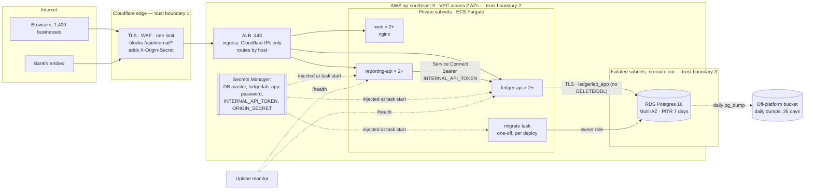

# Infrastructure plan

|                        |                                                                                                 |
| ---------------------- | ----------------------------------------------------------------------------------------------- |
| **Author**             | Rizki Budi                                                                                      |
| **Date**               | 2026-10-01                                                                                      |
| **Target environment** | AWS ECS Fargate + RDS, Jakarta (`ap-southeast-3`), behind Cloudflare                            |
| **Status**             | Review: rehearsed locally end to end; CDK stacks tested; AWS account and domain not provisioned |
| **Related**            | [`SECURITY.md`](SECURITY.md), [`DEPLOYMENT.md`](DEPLOYMENT.md), [`DATABASE.md`](DATABASE.md)    |

Every number in this document is either measured (with a link to the evidence) or
marked **estimate** with the assumption stated. AWS prices are the on-demand
list prices for `ap-southeast-3` from the AWS Price List API, read on
2026-10-01; Cloudflare's are its published list prices on the same date.

---

## 1. Executive summary

- **Compute:** three stateless services (ledger API, reporting API, dashboard)
  on ECS Fargate, **at least two tasks each** across two availability zones,
  autoscaling to six on CPU. Infrastructure is code (`infra/aws`, AWS CDK);
  migrations run as a one-off task before every roll.
- **Data:** RDS PostgreSQL 16, Multi-AZ, with 7-day point-in-time recovery, plus
  a daily logical backup kept outside AWS. The database itself refuses unbalanced or
  edited entries. A full restore of one year of data was **performed and verified
  identical** in 17 seconds ([evidence](evidence/G9-restore-drill.md)).
- **Edge:** Cloudflare in front of everything: TLS, WAF, rate limiting,
  `/api/internal` blocked at the edge; the load balancer admits only
  Cloudflare's IP ranges, and the APIs also require Cloudflare's origin secret.
- **Reliability target:** 99.9% monthly availability (43 minutes of downtime
  budget), RPO 5 minutes, RTO 1 hour (region loss: RPO 24 h, RTO 4 h).
- **Cost:** about **$283/month** today, **$396** at 3× and **$697** at 10×
  (§12). Not built on purpose: multi-region, Kubernetes (EKS), a cache tier,
  user authentication (see `SECURITY.md` §10).
- **Fixed before go-live:** reports used to read every journal line in history;
  with one year of data they fell to ~5 requests/second. Daily balance rollups
  (ADR-003) brought the worst case to 342 req/s, p99 95 ms, at the same volume
  ([§13](#capacity-arithmetic), [evidence](evidence/rollups.md)).

## 2. Current vs target

| Concern       | Today (vibe-coded)      | Target (this plan)                                                                      | Why it matters              |
| ------------- | ----------------------- | --------------------------------------------------------------------------------------- | --------------------------- |
| Compute       | One VM, one process     | ≥ 2 Fargate tasks per service in 2 AZs, health-checked, rolling deploys, graceful drain | Survive payday traffic      |
| Data          | SQLite file, no backups | RDS Postgres 16 Multi-AZ, PITR 7 days, daily off-platform dump, restore drilled         | No total data loss          |
| Networking    | Public DB, `*` CORS     | DB in isolated subnets; CORS = dashboard origin; Cloudflare WAF; Cloudflare-only ALB    | Bank review                 |
| Secrets       | Shared password in repo | Secrets Manager; generated internal token; least-privilege DB role; boot fails closed   | Credential compromise       |
| Observability | None                    | CloudWatch logs + metrics, external uptime checks on both `/health`, alerts on 5xx, p95 | Prove 99.9%                 |
| Deploy        | Manual, on the box      | One command: images from lockfile → migrate task → rolling deploy; automatic rollback   | Reproducible, rollback-able |

## 3. Architecture

Trust boundaries: (1) the internet stops at Cloudflare; (2) the load balancer
accepts only Cloudflare's IP ranges on 443, and the APIs only answer requests
that carry Cloudflare's origin secret, except `/health` and the token-guarded
internal path, which reporting reaches over Service Connect, never through the
load balancer; (3) the database has no public address or internet route, and
the app connects over TLS as a role that cannot delete, truncate or alter
anything.

**Against reality:** the same shape (Postgres, migration job, 2 + 2 replicas
behind a round-robin load balancer, dashboard) runs locally from
`deployment/docker-compose.prod.yml` and is rehearsed in
[G4 evidence](evidence/G4-deploy-rehearsal.md). The AWS stacks synthesize (86
resources) and their key properties are asserted by tests
(`infra/aws/test/stacks.test.ts`: 2 tasks per service, Cloudflare-only ingress,
secrets never in plain environment, RDS settings). They are not yet deployed
(no AWS account or domain on the build machine). That is the first item of §6's
go-live checklist.

## 4. Environments

| Environment | Purpose                        | Data                                      | Access                     | Notes                                 |
| ----------- | ------------------------------ | ----------------------------------------- | -------------------------- | ------------------------------------- |
| Local       | Developer                      | In-memory (seeded) or local Postgres      | Any                        | `pnpm dev`; `docker compose up -d db` |
| Rehearsal   | Production shape on one laptop | Synthetic (up to 1 year at real volume)   | Developer                  | `deployment/docker-compose.prod.yml`  |
| Staging     | Pre-prod, migration rehearsal  | Synthetic only; never a copy of customers | Team                       | Same CDK app in a second account      |
| Production  | Customers and the bank         | Real                                      | Two named admins, with MFA | Private subnets; changes only via git |

Config differs only through environment variables (table in
[`DEPLOYMENT.md`](DEPLOYMENT.md#environment-variables)). Each environment has its
own generated `INTERNAL_API_TOKEN`, its own database and role passwords, and its
own `ORIGIN_SECRET`. Nothing is shared across environments. Production refuses
to boot with missing secrets or `CORS_ORIGINS=*` (`packages/shared/src/http.ts`).
Staging uses synthetic data because the client story forbids moving customer
data into less-protected places.

## 5. Compute, scaling and capacity

| Service       | vCPU | Memory | Min | Max | Scale metric  | Timeouts                                        |
| ------------- | ---- | ------ | --- | --- | ------------- | ----------------------------------------------- |
| ledger-api    | 0.5  | 1 GB   | 2   | 6   | CPU 70% (ECS) | DB connect 10 s, health DB ping 2 s, drain 10 s |
| reporting-api | 0.25 | 512 MB | 2   | 6   | CPU 70% (ECS) | upstream (ledger) 5 s, drain on SIGTERM         |
| web (nginx)   | 0.25 | 512 MB | 2   | 6   | CPU 70% (ECS) | —                                               |

- **Why two tasks minimum:** the brief asks for at least two replicas, and the
  99.9% target needs a service to survive a task or an AZ failing and to deploy
  without a gap. ECS spreads the two tasks across both AZs; deploys run with
  minimum healthy 100% / maximum 200%, so a roll starts new tasks before
  stopping old ones and never drops below two. A roll whose new tasks fail
  health checks is rolled back by the deployment circuit breaker.
- **Why this size:** at 1× the APIs are not the bottleneck. A ledger request is
  a few milliseconds of Node work; the database does the heavy lifting (§13).
  The second task is for availability, not throughput.
- **Autoscaling:** on, 2–6 tasks per service at 70% CPU. Its ceiling is the
  database: scaling API tasks does not help when Postgres is busy, and each
  ledger task holds up to 10 connections (6 × 10 + 1 migration = 61, well under
  the instance limit).
- **Cold starts:** none. Fargate tasks are always on; minimum 2.
- **Graceful shutdown:** verified. SIGTERM stops accepting, drains in-flight
  requests, then closes the pool, with a 10 s hard exit. The ALB stops sending
  new requests first (15 s deregistration delay). The rehearsal stopped a
  replica under load and 300/300 requests succeeded
  ([G4 evidence §5](evidence/G4-deploy-rehearsal.md)).
- **Payday:** the 9 pm spike is about 12 requests/second at 1× (§13). Rate
  limits are 300/min per IP per task on the ledger API and 120 on reporting,
  keyed on `CF-Connecting-IP` (trusted only because the ALB admits nothing but
  Cloudflare), with Cloudflare's 50 per 10 s per IP as the authoritative limit.

## 6. Data and durability

- **Engine:** PostgreSQL 16 on Amazon RDS
  ([`DATABASE.md`](DATABASE.md) and ADR-002). The ledger's invariants live in the
  database (deferred balance trigger, append-only triggers, CHECKs), so even a
  bad deploy cannot write an unbalanced entry.
- **Instance:** `db.t4g.small` (2 vCPU burstable, 2 GB RAM), gp storage 20 GB
  autoscaling to 100 GB, encrypted, TLS required. One year of data is 209 MB
  including indexes (measured), so the whole working set fits in memory.
- **HA:** Multi-AZ from day one: a synchronous standby in the second AZ that RDS
  promotes on instance or AZ failure (AWS documents failover as typically one to
  two minutes). The apps reconnect through the same endpoint.
- **Backups:**
  1. RDS automated backups: daily snapshot plus transaction logs, 7-day PITR
     window, encrypted with the instance's key; a final snapshot on stack
     deletion, and deletion protection on.
  2. Daily logical backup: `pg_dump -Fc` at 02:00 WIB to a bucket outside AWS
     (Cloudflare R2), kept 35 days. This covers loss of the AWS account or
     region, which PITR does not. Not built yet: it needs the R2 bucket and its
     key, so it is step 3 of the go-live checklist below (an ECS scheduled
     task with the ledger image).
- **Restore drill:** performed on 2026-10-01 against one year of synthetic data
  (372,001 entries / 744,002 lines). `pg_restore` into a fresh Postgres 16 took
  9.2 s. Fingerprints (per-account totals, trial-balance net, MD5 over every
  line, trigger count) were identical. The integrity triggers and role grants
  still held, and the API image served a balanced trial balance from the
  restored database ([evidence](evidence/G9-restore-drill.md)).
- **Migrations:** forward-only, idempotent SQL files applied by
  `node dist/migrate.js` as a one-off ECS task before each roll (never on boot),
  as the owner role. The same step creates `ledgerlab_app` and sets its password
  from Secrets Manager. One release of backward compatibility: add, switch, drop
  later. CI runs every migration twice from the runtime image.
- **Connection pooling:** postgres.js pool, max 10 per instance, idle timeout
  20 s, connect timeout 10 s. 2 ledger tasks × 10 + 1 migration job = 21
  connections at 1×, 61 at the autoscaling maximum.
- **Retention and PII:** journal data is kept indefinitely (accounting records;
  Indonesian law requires 10 years). The ledger holds business names, memos and
  amounts, with no personal identity documents. Logs carry no request bodies.

| Guarantee                      | Value                                        | How it is met                                                                                             |
| ------------------------------ | -------------------------------------------- | --------------------------------------------------------------------------------------------------------- |
| Recovery Point Objective (RPO) | 0 for AZ loss; 5 minutes (region loss: 24 h) | Multi-AZ synchronous standby; PITR from transaction logs; daily off-platform dump for region/account loss |
| Recovery Time Objective (RTO)  | 1 hour (AZ loss: minutes; bad deploy: 5 min) | Multi-AZ failover; PITR restore to a new instance + repoint `PGHOST`; rollback by image tag; CDK + dump   |
| Backup frequency / retention   | Continuous / 7 days; daily / 35 days         | RDS automated backups; scheduled `pg_dump` task → R2 with a lifecycle rule                                |
| Restore drill result           | 17 s end to end, identical fingerprints      | [evidence/G9-restore-drill.md](evidence/G9-restore-drill.md) (local, Postgres 16, 1 year of data)         |

**Go-live checklist (needs the real accounts; in this order):**

1. AWS account with `ap-southeast-3` enabled, a budget alarm, `cdk bootstrap`;
   domain on Cloudflare. Then `deployment/aws/deploy.sh` (first run: ACM DNS
   validation records into Cloudflare).
2. Cloudflare per [`deployment/cloudflare/README.md`](../deployment/cloudflare/README.md)
   and the AWS specifics in [`deployment/aws/README.md`](../deployment/aws/README.md);
   run its verification block.
3. Create the R2 bucket (35-day lifecycle rule) and the daily `pg_dump`
   scheduled task; run it once by hand and restore that file with the drill
   procedure.
4. **RDS PITR drill:** restore production to a new instance at T−10 minutes,
   run the fingerprint SQL from the drill evidence against both, and time it.
   Append the result to the evidence file. This replaces the 1-hour RTO
   estimate with a measurement. Also force one Multi-AZ failover (reboot with
   failover) and record the time `/health` was 503.
5. Uptime monitor on both `/health` URLs; CloudWatch alarms; alert routes tested.

## 7. Networking, DNS, TLS and edge

- **DNS:** the client's domain on Cloudflare, proxied: `ledgerlab.example.com` →
  web, `api.` → ledger, `reports.` → reporting.
- **TLS:** terminated at Cloudflare (edge certificate, minimum TLS 1.2, HSTS
  preload) and again at the ALB (ACM certificate for the three names,
  DNS-validated, AWS's recommended TLS policy), with Cloudflare in
  **Full (strict)** mode. Both certificates renew automatically. The ALB has no
  port 80 listener.
- **WAF and rate limiting:** Cloudflare managed ruleset + OWASP core ruleset
  (Pro plan); a custom rule blocks `/api/internal/*` on any method; a method
  allow-list; 50 requests per 10 s per IP on `/api/*`. The app's own limiter
  stays as defence in depth.
- **Origin lock, two layers:** the ALB's security group admits only
  Cloudflare's published IPv4 ranges on 443 (listed in `infra/aws/lib/stacks.ts`
  with the date read; re-check when Cloudflare changes them). That alone would
  still admit another Cloudflare customer's zone pointed at our ALB, so
  Cloudflare also adds `X-Origin-Secret` and both APIs reject requests without
  it (`requireOriginSecret`).
- **Private network:** tasks run in private subnets with no public IP; only the
  ALB is public. Reporting reaches the ledger over ECS Service Connect
  (`http://ledger-api:4001`), token-authenticated. The database sits in isolated
  subnets with no route to the internet and accepts connections only from the
  ledger and migration tasks' security groups.
- **Egress:** one NAT gateway for image pulls, logs and Secrets Manager. The
  APIs call only each other and the database; the backup task calls R2. One NAT
  gateway is a single-AZ dependency for starting new tasks (running tasks keep
  serving); VPC endpoints or a second NAT remove it (noted in the stack).

## 8. Secrets and identity

| Secret                   | Source                                     | Injected into               | Rotation                                                       |
| ------------------------ | ------------------------------------------ | --------------------------- | -------------------------------------------------------------- |
| DB master (owner)        | RDS-generated, in Secrets Manager          | migrate task only           | Secrets Manager rotation, then the next deploy                 |
| `ledgerlab_app` password | Secrets Manager (generated)                | ledger-api, migrate task    | Change the secret → deploy (migrate re-applies it, tasks roll) |
| `INTERNAL_API_TOKEN`     | Secrets Manager (generated, 64 characters) | both APIs                   | Quarterly and on staff change; update → force a new deployment |
| `ORIGIN_SECRET`          | Secrets Manager (generated, 64 characters) | both APIs + Cloudflare rule | Set new on Cloudflare and AWS in one change window             |

- No secret is baked into an image (images contain `dist/` only), and `.env` is
  gitignored. Both rotations were rehearsed: old values rejected, new accepted,
  APIs healthy throughout ([G5 evidence](evidence/G5-security.md#rotation)).
- **Identities:** the runtime role `ledgerlab_app` can `SELECT, INSERT` on the
  three tables and `UPDATE` two columns (`accounts.is_active`,
  `journal_entries.status`). No `DELETE`, `TRUNCATE` or DDL, and this is
  verified by tests. Migrations use the owner role, read only by `migrate.js`.
  ECS injects each secret as its own environment variable at task start
  (`PGPASSWORD`, not a URL), so no credential appears in the task definition or
  the CloudFormation template (asserted in `infra/aws/test`).
- **Who can read production secrets:** the task execution role (to inject
  them) and the two account admins (Kira and the lead engineer) via IAM Identity
  Center with MFA. CloudTrail records every `GetSecretValue`.

## 9. CI/CD and release

| Stage          | Trigger             | What runs                                                                                                              | Gate     |
| -------------- | ------------------- | ---------------------------------------------------------------------------------------------------------------------- | -------- |
| PR / push      | push, pull request  | `verify`: ai:verify, typecheck, migrate test DB, tests (incl. Postgres contract), challenge suite, build, format check | Required |
| Images         | push, pull request  | `images`: build all three images from the lockfile, migrate from the runtime image twice, boot the API on Postgres     | Required |
| Deploy staging | manual dispatch     | `deployment/aws/deploy.sh` against the staging account: build, push, migrate task, rolling deploy behind health checks | Manual   |
| Deploy prod    | approval            | Same script and same image tag against production, after staging passed                                                | Manual   |
| Rollback       | on-call / automatic | Circuit breaker rolls back a failed roll; otherwise `cdk deploy -c imageTag=<previous sha>` (30 images kept in ECR)    | —        |

Deploys are started by hand in GitHub Actions (`.github/workflows/deploy.yml`)
from `main`, assuming an IAM role through OIDC that only this repository's
`production` environment can use (`LedgerLabGithub` stack); no AWS keys are
stored in GitHub. Today there is one environment; staging is a second account
with its own role and a second GitHub environment.

**Rollback procedure:** deploy the previous image tag (command in
`deployment/aws/README.md`; a rolling update, no downtime, a few minutes). The database is not rolled
back. The migration rule (backward compatible for one release) guarantees the
previous code runs on the new schema. A migration is never reverted in
production; a fix rolls forward as a new migration.

## 10. Observability and SLOs

- **Logs:** stdout, collected by CloudWatch Logs (30-day retention); one line per
  request (method, path, status, duration) plus unhandled errors with the failing
  query. They are not yet structured JSON, so that is next-phase work.
- **Metrics:** ECS per-service CPU and memory; ALB request count, 5xx and
  target response time per service; RDS CPU, memory, connections and storage.
  Alarms on these are the next step (not in the stack yet).
- **Uptime:** an external monitor (Better Stack or UptimeRobot free tier) checks
  both public `/health` URLs every minute from two regions; `/health` returns
  503 when the database is unreachable, so it measures what users get.
- **Traces:** not instrumented. With two services and one hop, request logs plus
  the 5 s upstream timeout are enough at this size.
- **Error budget policy:** 99.9% = 43 minutes a month. If more than half is spent
  before the 15th, feature deploys stop and the next sprint goes to the cause.

| SLO                    | Target                    | Alert if                                    | Owner                        |
| ---------------------- | ------------------------- | ------------------------------------------- | ---------------------------- |
| Availability           | 99.9%                     | 5xx > 1% for 5 min, or `/health` down 2 min | On-call engineer (lead eng.) |
| Latency (ledger reads) | p95 < 300 ms              | p95 > 300 ms for 10 min                     | Lead engineer                |
| Latency (reports)      | p95 < 800 ms              | p95 > 800 ms for 10 min                     | Lead engineer                |
| Freshness (reports)    | 0 s: read from the ledger | Reporting 5xx (upstream timeout) > 1%       | Lead engineer                |

Reports have no cache, so freshness is immediate by construction: the rollups
are written in the same transaction as each post and void. Rehearsal p99 is
≤ 103 ms, so the 800 ms report target leaves room for the smaller production CPUs.
**Rollup drift:** a nightly scheduled task (not built yet) runs `SELECT count(*) FROM ledger_rollup_drift`
and alerts if it is not 0.

## 11. Security controls

The full checklist with evidence is [`SECURITY.md`](SECURITY.md); this is the
summary the bank asked for.

| Control                           | Implemented                                  | Evidence                                                                                            |
| --------------------------------- | -------------------------------------------- | --------------------------------------------------------------------------------------------------- |
| No secrets in git                 | Yes                                          | `SECURITY.md` §1; history scan                                                                      |
| `/api/internal/*` blocked at edge | Configured, not yet live (needs domain)      | `deployment/cloudflare/README.md` §3; token guard live: `ledger-api.test.ts` "guards /api/internal" |
| CORS restricted                   | Yes; boot fails on `*` in production         | `http.test.ts`; `SECURITY.md` §3                                                                    |
| HSTS + secure headers             | Yes (APIs and dashboard)                     | [G5 evidence](evidence/G5-security.md#api-security-headers); `deployment/nginx.conf.template`       |
| Rate limiting on `/api/*`         | App limiter live; Cloudflare rule configured | [G5 evidence](evidence/G5-security.md#rate-limit); cloudflare README §4                             |
| DB least-privilege user           | Yes                                          | `0003_app_role.sql`; denial tests in `repository-contract.test.ts`                                  |
| Origin locked to Cloudflare       | Yes: ALB IP allow-list + origin secret       | `requireOriginSecret` + tests; Cloudflare-only ingress asserted in `infra/aws/test`                 |
| Tested restore                    | Yes (local); RDS PITR drill at go-live       | [G9 restore drill](evidence/G9-restore-drill.md)                                                    |

## 12. Cost model

When the multiples arrive is an estimate: at the stated ~30% month-over-month
growth, 3× is about 4 months out (1.3⁴·² ≈ 3, around February 2027) and 10× is
about 9 months out (1.3⁸·⁸ ≈ 10, around mid-2027).

Unit prices (on-demand, `ap-southeast-3`, 730 hours a month): Fargate
$0.05056 per vCPU-hour and $0.00553 per GB-hour; ALB $0.0252/hour plus $0.008
per LCU-hour; NAT gateway $0.059/hour plus $0.059/GB; public IPv4 $0.005/hour;
RDS PostgreSQL Multi-AZ `db.t4g.small` $0.102/hour, `db.t4g.medium` $0.203,
`db.m7g.large` $0.47; Multi-AZ gp storage $0.276/GB-month; Secrets Manager
$0.40 per secret-month. Singapore prices are identical for these items.

| Line item          | 1× (today)                                          | 3×                        | 10×                                 | Notes                                                      |
| ------------------ | --------------------------------------------------- | ------------------------- | ----------------------------------- | ---------------------------------------------------------- |
| Fargate            | $90 (6 tasks: ledger 2 × $22.49, others 4 × $11.25) | $112 (ledger avg 3 tasks) | $146 (ledger 4, reporting 3, web 2) | task counts above 2 are an **estimate** of autoscaling     |
| Database (RDS)     | $74 (`db.t4g.small` Multi-AZ)                       | $148 (`db.t4g.medium`)    | $343 (`db.m7g.large`)               | DB CPU is the scaling resource                             |
| Storage            | $6 (20 GB)                                          | $6 (20 GB)                | $14 (50 GB)                         | 17 MB/month of data today (§13); backups within free quota |
| Load balancer      | $24 (hourly + ~1 LCU)                               | $36 (~3 LCU)              | $77 (~10 LCU)                       | LCUs are an **estimate** from §13's request rates          |
| NAT gateway        | $44                                                 | $44                       | $46                                 | hourly charge dominates; data is image pulls and logs      |
| Public IPv4        | $11 (ALB × 2, NAT × 1)                              | $11                       | $11                                 |                                                            |
| Secrets Manager    | $2 (4 secrets)                                      | $2                        | $2                                  |                                                            |
| Logs, ECR          | $6 (**estimate**)                                   | $11 (**estimate**)        | $31 (**estimate**)                  | CloudWatch ingestion grows with requests                   |
| Edge / CDN / WAF   | $25 (Cloudflare Pro)                                | $25                       | $25                                 | Free plan lacks the OWASP ruleset the bank expects         |
| Backups (off-site) | ~$0 (R2 free tier)                                  | ~$0                       | ~$1                                 | R2 10 GB free, then $0.015/GB                              |
| Domain             | $1                                                  | $1                        | $1                                  | ~$12/year                                                  |
| **Total / month**  | **≈ $283**                                          | **≈ $396**                | **≈ $697**                          |                                                            |

Of the $283, about $130 is the price of the availability requirement: the second
task per service, the Multi-AZ standby and the NAT gateway. A Savings Plan or
reserved RDS instance cuts the compute and database lines once usage is known;
not assumed here.

**First money as traffic grows:** the database plan (CPU), triggered by Postgres
CPU above 70% for 15 minutes at peak or report p95 above 800 ms. The engineering
fix that would otherwise come first (rollups, ADR-003) is already done.

**Where the model breaks (10×):** reports no longer scale with lines; they read
days × active accounts, and once tenancy lands that is per business, so it stays
small. What grows with 10× traffic is posting: every post takes one global rollup
lock (a deliberate `ponytail:` simplification, fine below ~10 writes/s; 10× is
~1.3 writes/s at peak), and the list endpoint's `count(*)` over all entries
(114 req/s today). The next limits are
single-region (a Jakarta region outage means a 4 h restore elsewhere) and one write
database. Both are acceptable for a bookkeeping product at this size, and both
are named in ADR-002.

## 13. Failure modes and DR runbook

| Failure                                        | Blast radius                        | Detection                                           | Response                                                                                                     | Tested?                                                                             |
| ---------------------------------------------- | ----------------------------------- | --------------------------------------------------- | ------------------------------------------------------------------------------------------------------------ | ----------------------------------------------------------------------------------- |
| Database unavailable                           | All reads and writes fail           | `/health` → 503; uptime alert; 5xx alert            | Multi-AZ fails over by itself; if data is damaged, PITR to a new instance, repoint `PGHOST`, redeploy        | Restore: yes (local, 17 s). Health 503 on DB loss: yes (G3). Failover: at go-live   |
| Ledger service crash-loop                      | No posting; reports fail (upstream) | Health check fails; circuit breaker trips           | Old tasks keep serving (min healthy 100%); circuit breaker rolls back                                        | Yes: rolling stop of a replica, 300/300 OK (G4)                                     |
| Bad migration                                  | Deploy blocked or wrong data        | Migrate task exits non-zero → `deploy.sh` stops; CI | Old version keeps serving; fix forward. Wrong data: DB triggers block unbalanced/edited rows; PITR if needed | Idempotency: yes (CI migrates twice). Abort path: in the script, not run on AWS yet |
| AZ outage                                      | Half the tasks; DB primary maybe    | ALB health checks; RDS failover event               | ALB routes to the other AZ; RDS promotes the standby; ECS replaces tasks in the healthy AZ                   | By AWS design; failover drill at go-live                                            |
| Region outage                                  | Everything                          | Uptime monitor from two regions; AWS Health         | Deploy the CDK app in another region, restore latest R2 dump, move DNS at Cloudflare (RPO 24 h, RTO 4 h)     | Restore from dump: yes (local). Cross-region rebuild: no                            |
| Secret rotation failure                        | Reporting gets 401 from ledger      | 5xx on reporting; ledger 401 spike in logs          | Both services read the same secret; force a new deployment of both                                           | Yes: rotation rehearsed (G5)                                                        |
| Report overload (payday)                       | Slow dashboards; ledger posting OK  | Report p95 > 800 ms; DB CPU > 70%                   | Larger RDS class (Multi-AZ applies it to the standby first, then fails over); rollups already in place       | Yes: measured at one year of history, before and after rollups (below)              |
| Docker `/dev/shm` exhausted (self-hosted only) | Report queries 500                  | `53100 could not resize shared memory` in logs      | `shm_size: 256mb` on the Postgres container (now in both compose files)                                      | Found and fixed during this load test                                               |

### Capacity arithmetic

**Load (estimate, from the client's numbers):**

- Writes: 62,000 lines/month ≈ 31,000 entries/month ≈ 1,030/day. Payday peak
  hour = 3 × a normal day × 15% in that hour ≈ **465 entries/hour ≈ 0.13/s**.
  Negligible.
- Reads: 1,400 businesses × 25% active in the payday peak hour × 40 API calls
  per session ≈ 14,000 calls/hour ≈ 3.9 req/s, × 3 burst factor ≈ **12 req/s
  peak**, of which ~⅓ (**4 req/s**) are report/dashboard calls.
- At 10×: 120 req/s peak, 40 req/s reports.

**Capacity (measured; dev laptop, 2 replicas per API, local Postgres 16,
autocannon 10 connections × 15 s):**

| Endpoint                          | 1 month of history (62k lines) | 1 year of history (744k lines)          | 1 year, daily rollups (late month) |
| --------------------------------- | ------------------------------ | --------------------------------------- | ---------------------------------- |
| `GET /api/journal-entries` (list) | 462 req/s · p50 20 ms          | 108 req/s · p50 87 ms · p99 172 ms      | 114 req/s · p50 82 ms · p99 169 ms |
| `GET /api/reports/trial-balance`  | 73 req/s · p50 128 ms          | 4.8 req/s · p50 1,550 ms · p99 3,709 ms | 342 req/s · p50 24 ms · p99 95 ms  |
| `GET /api/reports/dashboard`      | 64 req/s · p50 148 ms          | 4.7 req/s · p50 1,568 ms · p99 4,101 ms | 213 req/s · p50 43 ms · p99 103 ms |
| `GET /api/reports/balance-sheet`  | 71 req/s · p50 130 ms          | 4.9 req/s · p50 1,470 ms · p99 4,684 ms | 452 req/s · p50 20 ms · p99 44 ms  |

The one-month column is from [G4](evidence/G4-deploy-rehearsal.md). The one-year
columns were run on 2026-10-01 against the same stack after loading the drill
dataset (rate limit raised for the test); the last one at `asOf=2026-09-29`,
the worst case for any month-based shortcut ([evidence](evidence/rollups.md)).

- **Lists:** 8 req/s needed vs 108 measured. More than 10× headroom.
- **Reports before rollups:** 4 req/s needed vs ~5 measured at one year of
  history; there was no headroom at 1×, and the client already has a year.
  `EXPLAIN ANALYZE` showed why: one report scanned and hash-joined every posted
  line (315 ms of CPU, all in cache). No index helps a full-history sum, and
  adding API instances does not help because the work is in the database.
- **With daily rollups:** 213–452 req/s for reports, about 50× the 1× need and 5×
  the 10× need (40 req/s), on this laptop. `db.t4g.small` has 2 burstable vCPUs
  against the laptop's several cores, so expect a fraction of that there
  (**estimate**: ÷ 6 still covers 3×). Measure it at go-live before trusting the
  10× figure.
- **Connections:** 2 × 10 + 1 = 21 at 1×; 6 × 10 + 1 = 61 at the autoscaling
  maximum (only the ledger holds a pool). RDS sets `max_connections` from
  instance memory; check it on the real instance at go-live.
- **Storage:** 209 MB / 744,002 lines ≈ 280 bytes per line including indexes.
  1×: 62,000 × 280 B ≈ 17 MB/month (≈ 210 MB/year). 3×: 52 MB/month.
  10×: 174 MB/month (≈ 2.1 GB/year). The 20 / 20 / 50 GB in §12 leave years of
  room, and storage autoscales to 100 GB.

## 14. Decision log (ADRs)

> **ADR-001 — AWS ECS Fargate in Jakarta (reverses the earlier Render choice).**
> _Context:_ the brief requires at least two replicas per service and a managed
> database with tested restore; the client story targets 99.9% with
> health-checked replicas and a bank review. The team prefers AWS.
> _Options:_ (a) AWS ECS Fargate + RDS + ALB; (b) AWS EKS; (c) GCP Cloud Run +
> Cloud SQL; (d) Render; (e) keep the VM and add backups.
> _Decision:_ (a), region `ap-southeast-3` (Jakarta). _Why:_ ECS gives the
> two-task minimum, rolling deploys with automatic rollback, private subnets,
> IP-restricted ingress, IAM-scoped secrets and Multi-AZ Postgres, all as
> reviewed, tested CDK code. Jakarta keeps customer data in Indonesia, closest to
> the users, at the same prices as Singapore. EKS (b) adds a $0.10/hour control
> plane and a cluster to upgrade and secure, for three stateless services that
> need none of Kubernetes' scheduling; it stays the answer only if the company
> standardises on Kubernetes. Render (d) was the first plan (~$100/month, no
> infrastructure code) and its blueprint still works, but it cannot restrict
> ingress by IP and has no region in Indonesia.
> Keeping the VM (e) fails the managed-database requirement.
> _Consequences:_ about $283/month instead of ~$100 (§12), most of it for
> availability; infrastructure code to maintain (`infra/aws`, with tests); the
> images and SQL still run anywhere, so lock-in is limited to the CDK app.

> **ADR-002 — Managed PostgreSQL 16, single region, single primary.**
> _Options:_ (a) stay on SQLite + Litestream replication; (b) self-hosted
> Postgres on a VM; (c) Neon/Supabase serverless Postgres; (d) Amazon RDS for
> PostgreSQL, Multi-AZ.
> _Decision:_ (d). _Why:_ tested PITR, encryption and failover are requirements,
> and operating a database is not Warung Books' differentiator. It sits in the
> same VPC as the APIs (Neon/Supabase would mean public-internet database
> traffic). Multi-AZ covers instance and AZ loss. SQLite cannot serve two app instances or enforce the
> invariants with deferred constraint triggers.
> _Rejected for now:_ multi-region, read replicas and Aurora. At 0.13 writes/s and a 99.9%
> target, a 4 h region-loss RTO is an acceptable, priced risk.
> _Consequences:_ the database is the scaling resource (§13); region loss relies
> on the daily off-platform dump.

> **ADR-003 — Reports read daily balance rollups maintained by triggers.**
> _Context:_ reports originally loaded every posting into JavaScript (and the
> reporting API pulled all of them over HTTP): 6 req/s at one month of data.
> _Options:_ (a) keep JS aggregation; (b) SQL `GROUP BY` per request (done in G4);
> (c) a materialized view refreshed on a schedule; (d) a Redis cache in front of
> reports; (e) monthly rollups plus raw lines for partial months; (f) daily
> rollups maintained in the same transaction as each post/void.
> _Decision:_ (b) in G4, then (f) (`0004_balance_rollups.sql`). _Why:_ (b) gave
> 12× and was small, but at one year of history it fell to ~5 req/s (§13). (c) is
> stale between refreshes and `REFRESH` contends with writes. (d) adds a service,
> and invalidation is wrong on back-dated entries, which accounting has. (e) was
> built and measured first: Postgres seq-scanned every line to fetch one partial
> month, so late in a month it managed only 15 req/s. (f) has no raw part at all
> and less code: 342 req/s at the late-month worst case.
> _Consequences:_ two trigger-maintained tables (app role read-only), a backfill
> that blocks writes for ~12 s per year of history, one global lock per posting
> transaction, and `ledger_rollup_drift`, a view that must stay empty (nightly
> check, and asserted in the contract test).

> **ADR-004 — Plain idempotent SQL migrations, applied as a pre-deploy step.**
> _Options:_ (a) `drizzle-kit migrate` with its tracking table; (b) Flyway or
> another external tool; (c) migrations on application boot; (d) ordered,
> idempotent SQL files run by a 40-line script on every deploy.
> _Decision:_ (d). _Why:_ the important schema (deferred constraint triggers,
> append-only triggers, role grants) is raw SQL that drizzle-kit does not
> generate. Running everything every time removes tracking-table drift. Running
> on boot (c) would race between two instances and make a failed migration a
> crash-loop instead of an aborted deploy.
> _Consequences:_ every migration must be idempotent (CI proves it by running
> them twice); a long data migration needs to be written as resumable.

> **ADR-005 — Cloudflare in front of AWS, origin locked by IP allow-list and secret.**
> _Options:_ (a) ALB + AWS WAF only; (b) Cloudflare with authenticated origin
> pulls (mTLS); (c) Cloudflare with an IP allow-list at the ALB; (d) Cloudflare
> plus an `X-Origin-Secret` header checked by the app; (e) (c) and (d) together.
> _Decision:_ (e). _Why:_ the bank requires a WAF, rate limiting and a recognised
> domain; Cloudflare Pro provides all three for $25/month with the OWASP ruleset,
> and its CDN serves the dashboard's assets. The security group admits only
> Cloudflare's ranges, so nobody can bypass the edge by calling the ALB directly.
> Those ranges are shared by all Cloudflare customers, so the secret header
> stops another zone from fronting our ALB. mTLS (b) needs a client-certificate
> check the ALB does in mutual-TLS mode with a trust store, which is more moving
> parts than the header for the same result. AWS WAF (a) would duplicate the edge.
> _Consequences:_ the IP list must follow Cloudflare's published ranges (dated
> in the stack); the secret is one more thing to rotate (§8); `/health` and the
> token-guarded internal path are exempt by design. The rate limiter keys on
> `CF-Connecting-IP`, which is trustworthy only because of the allow-list.
