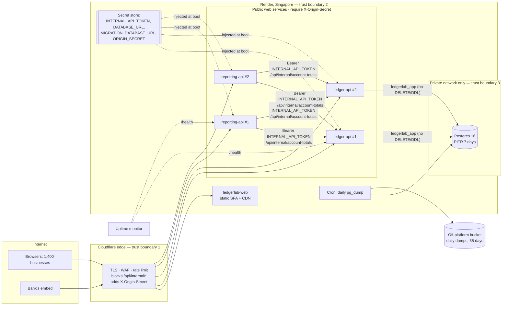

# Infrastructure plan

|                        |                                                                                              |
| ---------------------- | -------------------------------------------------------------------------------------------- |
| **Author**             | Rizki Budi                                                                                   |
| **Date**               | 2026-10-01                                                                                   |
| **Target environment** | Render (Singapore) behind Cloudflare                                                         |
| **Status**             | Review: rehearsed locally end to end; the Render account and domain are not yet provisioned  |
| **Related**            | [`SECURITY.md`](SECURITY.md), [`DEPLOYMENT.md`](DEPLOYMENT.md), [`DATABASE.md`](DATABASE.md) |

Every number in this document is either measured (with a link to the evidence) or
marked **estimate** with the assumption stated. Prices are Render's and
Cloudflare's published list prices as read on 2026-10-01.

---

## 1. Executive summary

- **Compute:** two stateless API services (ledger, reporting), two instances each,
  plus the dashboard as a static site; deployed from git by a committed blueprint
  (`deployment/render.yaml`), with migrations as a separate pre-deploy step.
- **Data:** managed PostgreSQL 16 with 7-day point-in-time recovery, plus a daily
  logical backup kept off Render. The database itself refuses unbalanced or
  edited entries. A full restore of one year of data was **performed and verified
  identical** in 17 seconds ([evidence](evidence/G9-restore-drill.md)).
- **Edge:** Cloudflare in front of everything: TLS, WAF, rate limiting,
  `/api/internal` blocked at the edge, origin locked to Cloudflare.
- **Reliability target:** 99.9% monthly availability (43 minutes of downtime
  budget), RPO 5 minutes, RTO 1 hour (region loss: RPO 24 h, RTO 4 h).
- **Cost:** about **$100/month** today, **$181** at 3× and **$480** at 10×.
  Not built on purpose: multi-region, autoscaling, Kubernetes, a cache tier,
  user authentication (see `SECURITY.md` §10).
- **The one thing to fix before go-live:** reports read every journal line in
  history. With one year of data, measured report throughput falls from ~70 to
  ~5 requests/second ([§13](#capacity-arithmetic)). Monthly balance rollups
  (ADR-003) fix this, and they are milestone 1 of the next phase.

## 2. Current vs target

| Concern       | Today (vibe-coded)      | Target (this plan)                                                                        | Why it matters              |
| ------------- | ----------------------- | ----------------------------------------------------------------------------------------- | --------------------------- |
| Compute       | One VM, one process     | 2 + 2 stateless instances, health-checked, rolling deploys, graceful drain                | Survive payday traffic      |
| Data          | SQLite file, no backups | Managed Postgres 16, PITR 7 days, daily off-platform dump, restore drilled                | No total data loss          |
| Networking    | Public DB, `*` CORS     | DB on the private network only; CORS = dashboard origin; Cloudflare WAF; origin lock      | Bank review                 |
| Secrets       | Shared password in repo | Render secret store; generated internal token; least-privilege DB role; boot fails closed | Credential compromise       |
| Observability | None                    | Render logs + metrics, external uptime checks on both `/health`, alerting on 5xx and p95  | Prove 99.9%                 |
| Deploy        | Manual, on the box      | `git push` → images from lockfile → migrate → rolling deploy; one-click rollback          | Reproducible, rollback-able |

## 3. Architecture

Trust boundaries: (1) the internet stops at Cloudflare; (2) the APIs only answer
requests that carry Cloudflare's origin secret, except `/health` and the
token-guarded internal path; (3) the database has no public address and the app
connects as a role that cannot delete, truncate or alter anything.

**Against reality:** the same shape (Postgres, migration job, 2 + 2 replicas
behind a round-robin load balancer, dashboard) runs locally from
`deployment/docker-compose.prod.yml` and is rehearsed in
[G4 evidence](evidence/G4-deploy-rehearsal.md). The Render deploy and the
Cloudflare layer are configured in the repository but not yet provisioned (no
Render account or domain on the build machine). This is the first item of §6's
go-live checklist.

## 4. Environments

| Environment | Purpose                        | Data                                      | Access                     | Notes                                       |
| ----------- | ------------------------------ | ----------------------------------------- | -------------------------- | ------------------------------------------- |
| Local       | Developer                      | In-memory (seeded) or local Postgres      | Any                        | `pnpm dev`; `docker compose up -d db`       |
| Rehearsal   | Production shape on one laptop | Synthetic (up to 1 year at real volume)   | Developer                  | `deployment/docker-compose.prod.yml`        |
| Staging     | Pre-prod, migration rehearsal  | Synthetic only; never a copy of customers | Team                       | Same blueprint, a second Render environment |
| Production  | Customers and the bank         | Real                                      | Two named admins, with 2FA | Private networking; changes only via git    |

Config differs only through environment variables (table in
[`DEPLOYMENT.md`](DEPLOYMENT.md#environment-variables)). Each environment has its
own generated `INTERNAL_API_TOKEN`, its own database and role passwords, and its
own `ORIGIN_SECRET`. Nothing is shared across environments. Production refuses
to boot with missing secrets or `CORS_ORIGINS=*` (`packages/shared/src/http.ts`).
Staging uses synthetic data because the client story forbids moving customer
data into less-protected places.

## 5. Compute, scaling and capacity

| Service       | vCPU | Memory | Min | Max | Scale metric                       | Timeouts                                        |
| ------------- | ---- | ------ | --- | --- | ---------------------------------- | ----------------------------------------------- |
| ledger-api    | 0.5  | 512 MB | 2   | 2   | manual; add when CPU > 70% at peak | DB connect 10 s, health DB ping 2 s, drain 10 s |
| reporting-api | 0.5  | 512 MB | 2   | 2   | manual; add when CPU > 70% at peak | upstream (ledger) 5 s, drain on SIGTERM         |
| web           | CDN  | —      | —   | —   | —                                  | —                                               |

- **Why this size:** at 1× the APIs are not the bottleneck. A ledger request is
  a few milliseconds of Node work; the database does the heavy lifting (§13).
  Two instances are for availability (rolling deploys, one instance failing),
  not throughput. Starter instances are $7 each.
- **Autoscaling:** deliberately not enabled. It needs the Pro workspace (which we
  buy anyway), but scaling API instances does not help when the database is the
  bottleneck, and each instance adds 10 database connections. Revisit at 3×.
- **Cold starts:** none. Paid instances do not sleep; minimum 2.
- **Graceful shutdown:** verified. SIGTERM stops accepting, drains in-flight
  requests, then closes the pool, with a 10 s hard exit. The rehearsal stopped a
  replica under load and 300/300 requests succeeded
  ([G4 evidence §5](evidence/G4-deploy-rehearsal.md)).
- **Payday:** the 9 pm spike is about 12 requests/second at 1× (§13). Rate
  limits are 300/min per IP per instance on the ledger API and 120 on reporting,
  with Cloudflare's 50 per 10 s per IP as the authoritative limit.

## 6. Data and durability

- **Engine:** PostgreSQL 16, managed by Render
  ([`DATABASE.md`](DATABASE.md) and ADR-002). The ledger's invariants live in the
  database (deferred balance trigger, append-only triggers, CHECKs), so even a
  bad deploy cannot write an unbalanced entry.
- **Plan:** `basic-1gb` (0.5 CPU, 1 GB RAM, 100 connections, $19). One year of
  data is 209 MB including indexes (measured), so the whole working set fits in
  memory. The 256 MB plan the blueprint started with would not hold it.
- **HA:** single instance at 1×. Recovery from instance failure relies on
  Render's managed restart and PITR. A hot standby is a 10× line item (§12).
- **Backups:**
  1. Render PITR: continuous WAL archiving, 7-day window on the Pro workspace,
     encrypted at rest by Render.
  2. Daily logical backup: a Render cron job runs `pg_dump -Fc` at 02:00 WIB and
     uploads to a bucket outside Render (Cloudflare R2), keeping 35 days. This
     covers loss of the Render account or region, which PITR does not. Not in
     the blueprint yet: it needs the R2 bucket and its key, so it is step 2 of
     the go-live checklist below.
- **Restore drill:** performed on 2026-10-01 against one year of synthetic data
  (372,001 entries / 744,002 lines). `pg_restore` into a fresh Postgres 16 took
  9.2 s. Fingerprints (per-account totals, trial-balance net, MD5 over every
  line, trigger count) were identical. The integrity triggers and role grants
  still held, and the API image served a balanced trial balance from the
  restored database ([evidence](evidence/G9-restore-drill.md)).
- **Migrations:** forward-only, idempotent SQL files applied by
  `node dist/migrate.js` as Render's `preDeployCommand` (never on boot), as the
  owner role. One release of backward compatibility: add, switch, drop later.
  CI runs every migration twice from the runtime image.
- **Connection pooling:** postgres.js pool, max 10 per instance, idle timeout
  20 s, connect timeout 10 s. 2 instances × 10 + 1 migration job = 21 of the
  plan's 100 connections.
- **Retention and PII:** journal data is kept indefinitely (accounting records;
  Indonesian law requires 10 years). The ledger holds business names, memos and
  amounts, with no personal identity documents. Logs carry no request bodies.

| Guarantee                      | Value                                        | How it is met                                                                                              |
| ------------------------------ | -------------------------------------------- | ---------------------------------------------------------------------------------------------------------- |
| Recovery Point Objective (RPO) | 5 minutes (region loss: 24 h)                | PITR continuous WAL archiving; daily off-platform dump for region or account loss                          |
| Recovery Time Objective (RTO)  | 1 hour (bad deploy: 5 min; region loss: 4 h) | PITR restore to a new instance + repoint `DATABASE_URL`; one-click rollback; rebuild from blueprint + dump |
| Backup frequency / retention   | Continuous / 7 days; daily / 35 days         | Render PITR (Pro workspace); cron `pg_dump` → R2 with a lifecycle rule                                     |
| Restore drill result           | 17 s end to end, identical fingerprints      | [evidence/G9-restore-drill.md](evidence/G9-restore-drill.md) (local, Postgres 16, 1 year of data)          |

**Go-live checklist (needs the real accounts; in this order):**

1. Apply the blueprint; fill the `sync: false` secrets; create `ledgerlab_app`.
2. Create the R2 bucket (35-day lifecycle rule) and the daily `pg_dump` cron
   job; run it once by hand and restore that file with the drill procedure.
3. **Render PITR drill:** restore production to a new database at T−10 minutes,
   run the fingerprint SQL from the drill evidence against both, and time it.
   Append the result to the evidence file. This replaces the 1-hour RTO
   estimate with a measurement.
4. Cloudflare per [`deployment/cloudflare/README.md`](../deployment/cloudflare/README.md);
   run its verification block.
5. Uptime monitor on both `/health` URLs; alert routes tested.

## 7. Networking, DNS, TLS and edge

- **DNS:** the client's domain on Cloudflare, proxied: `ledgerlab.example.com` →
  web, `api.` → ledger, `reports.` → reporting.
- **TLS:** terminated at Cloudflare (edge certificate, minimum TLS 1.2, HSTS
  preload) and again at Render (Render-managed origin certificate), with
  Cloudflare in **Full (strict)** mode. Both certificates renew automatically.
- **WAF and rate limiting:** Cloudflare managed ruleset + OWASP core ruleset
  (Pro plan); a custom rule blocks `/api/internal/*` on any method; a method
  allow-list; 50 requests per 10 s per IP on `/api/*`. The app's own limiter
  stays as defence in depth.
- **Origin lock:** Render cannot restrict ingress by IP or require mTLS, so
  Cloudflare adds `X-Origin-Secret` and both APIs reject requests without it
  (`requireOriginSecret`), so a direct call to `*.onrender.com` gets `403`.
- **Private network:** reporting → ledger over Render's private network
  (`http://ledgerlab-ledger-api:4001`), token-authenticated. The database has no
  public address. **All services and the database must be in the same region**
  (private networking is per region). The blueprint pins `singapore` on every
  resource, closest to Jakarta.
- **Egress:** none at runtime. The APIs call only each other and the database.
  The backup cron job calls R2.

## 8. Secrets and identity

| Secret                   | Source                                          | Injected into              | Rotation                                                         |
| ------------------------ | ----------------------------------------------- | -------------------------- | ---------------------------------------------------------------- |
| `INTERNAL_API_TOKEN`     | Render `generateValue`, shared by `fromService` | both APIs                  | Quarterly and on staff change; regenerate → both redeploy        |
| `DATABASE_URL`           | Operator, from the password manager             | ledger-api                 | Quarterly: `ALTER ROLE ledgerlab_app PASSWORD`, update, redeploy |
| `MIGRATION_DATABASE_URL` | Render `fromDatabase` (owner)                   | ledger-api pre-deploy only | With Render's credential rotation                                |
| `ORIGIN_SECRET`          | `openssl rand -hex 32`                          | both APIs + CF transform   | Set new on CF and origin in one change window                    |

- No secret is baked into an image (images contain `dist/` only), and `.env` is
  gitignored. Both rotations were rehearsed: old values rejected, new accepted,
  APIs healthy throughout ([G5 evidence](evidence/G5-security.md#rotation)).
- **Identities:** the runtime role `ledgerlab_app` can `SELECT, INSERT` on the
  three tables and `UPDATE` two columns (`accounts.is_active`,
  `journal_entries.status`). No `DELETE`, `TRUNCATE` or DDL, and this is
  verified by tests. Migrations use the owner role, read only by `migrate.js`.
- **Who can read production secrets:** the two Render workspace admins (Kira and
  the lead engineer), with 2FA enforced. Render's workspace audit log (Pro)
  records access and changes.

## 9. CI/CD and release

| Stage          | Trigger            | What runs                                                                                                              | Gate      |
| -------------- | ------------------ | ---------------------------------------------------------------------------------------------------------------------- | --------- |
| PR / push      | push, pull request | `verify`: ai:verify, typecheck, migrate test DB, tests (incl. Postgres contract), challenge suite, build, format check | Required  |
| Images         | push, pull request | `images`: build all three images from the lockfile, migrate from the runtime image twice, boot the API on Postgres     | Required  |
| Deploy staging | merge to `main`    | Render staging: build, `preDeployCommand` migrate, rolling deploy behind `/health`                                     | Automatic |
| Deploy prod    | approval           | Same blueprint, `autoDeploy: false`; an admin clicks **Deploy** on the commit that passed staging                      | Manual    |
| Rollback       | on-call            | Render **Rollback** to the previous deploy (15 builds retained on Pro)                                                 | —         |

Today the blueprint has `autoDeploy: true` on the single environment. Splitting
staging from prod is a 10-minute change once the second environment exists.

**Rollback procedure:** Render dashboard → service → Deploys → previous deploy →
Rollback (about 2 minutes, rolling, no downtime). The database is not rolled
back. The migration rule (backward compatible for one release) guarantees the
previous code runs on the new schema. A migration is never reverted in
production; a fix rolls forward as a new migration.

## 10. Observability and SLOs

- **Logs:** stdout, collected by Render (14-day retention on Pro); one line per
  request (method, path, status, duration) plus unhandled errors with the failing
  query. They are not yet structured JSON, so that is next-phase work.
- **Metrics:** Render's per-service CPU, memory, HTTP request count, status
  classes and response time; Postgres CPU, memory, connections and storage.
- **Uptime:** an external monitor (Better Stack or UptimeRobot free tier) checks
  both public `/health` URLs every minute from two regions; `/health` returns
  503 when the database is unreachable, so it measures what users get.
- **Traces:** not instrumented. With two services and one hop, request logs plus
  the 5 s upstream timeout are enough at this size.
- **Error budget policy:** 99.9% = 43 minutes a month. If more than half is spent
  before the 15th, feature deploys stop and the next sprint goes to the cause.

| SLO                    | Target                    | Alert if                                    | Owner                        |
| ---------------------- | ------------------------- | ------------------------------------------- | ---------------------------- |
| Availability           | 99.9%                     | 5xx > 1% for 5 min, or `/health` down 2 min | On-call engineer (lead eng.) |
| Latency (ledger reads) | p95 < 300 ms              | p95 > 300 ms for 10 min                     | Lead engineer                |
| Latency (reports)      | p95 < 800 ms              | p95 > 800 ms for 10 min                     | Lead engineer                |
| Freshness (reports)    | 0 s: read from the ledger | Reporting 5xx (upstream timeout) > 1%       | Lead engineer                |

Reports have no cache, so freshness is immediate by construction. Their latency
target is looser than ledger reads until rollups land (§13).

## 11. Security controls

The full checklist with evidence is [`SECURITY.md`](SECURITY.md); this is the
summary the bank asked for.

| Control                           | Implemented                                  | Evidence                                                                                            |
| --------------------------------- | -------------------------------------------- | --------------------------------------------------------------------------------------------------- |
| No secrets in git                 | Yes                                          | `SECURITY.md` §1; history scan                                                                      |
| `/api/internal/*` blocked at edge | Configured, not yet live (needs domain)      | `deployment/cloudflare/README.md` §3; token guard live: `ledger-api.test.ts` "guards /api/internal" |
| CORS restricted                   | Yes; boot fails on `*` in production         | `http.test.ts`; `SECURITY.md` §3                                                                    |
| HSTS + secure headers             | Yes (APIs and dashboard)                     | [G5 evidence](evidence/G5-security.md#api-security-headers); `render.yaml` headers                  |
| Rate limiting on `/api/*`         | App limiter live; Cloudflare rule configured | [G5 evidence](evidence/G5-security.md#rate-limit); cloudflare README §4                             |
| DB least-privilege user           | Yes                                          | `0003_app_role.sql`; denial tests in `repository-contract.test.ts`                                  |
| Origin locked to Cloudflare       | Yes (activates when `ORIGIN_SECRET` is set)  | `requireOriginSecret` in `packages/shared/src/http.ts` + tests                                      |
| Tested restore                    | Yes (local); Render PITR drill at go-live    | [G9 restore drill](evidence/G9-restore-drill.md)                                                    |

## 12. Cost model

When the multiples arrive is an estimate: at the stated ~30% month-over-month
growth, 3× is about 4 months out (1.3⁴·² ≈ 3, around February 2027) and 10× is
about 9 months out (1.3⁸·⁸ ≈ 10, around mid-2027).

| Line item          | 1× (today)                           | 3×                                            | 10×                                               | Notes                                              |
| ------------------ | ------------------------------------ | --------------------------------------------- | ------------------------------------------------- | -------------------------------------------------- |
| Workspace          | $25 (Pro)                            | $25                                           | $25                                               | Pro for 7-day PITR, audit log, seats               |
| Compute (services) | $28 (4 × starter $7)                 | $64 (ledger 2 × 1c-2g $25 + reporting 2 × $7) | $150 (ledger 4 × $25 + reporting 2 × $25)         | static site free                                   |
| Database           | $19 (`basic-1gb`)                    | $55 (1c-4g)                                   | $200 (2c-8g $100 + HA standby, **estimate** $100) | DB CPU is the scaling resource                     |
| Storage            | $1.50 (5 GB × $0.30)                 | $3 (10 GB)                                    | $15 (50 GB)                                       | 17 MB/month of data today (§13)                    |
| Bandwidth          | $0 (≤ 25 GB included)                | $7.50 (~75 GB; 50 over × $0.15)               | $33.75 (~250 GB; 225 over × $0.15)                | **estimate**; assets served from Cloudflare cache  |
| Edge / CDN / WAF   | $25 (Cloudflare Pro)                 | $25                                           | $25                                               | Free plan lacks the OWASP ruleset the bank expects |
| Backups (off-site) | ~$0 (cron seconds/day; R2 free tier) | ~$0                                           | ~$1                                               | R2 10 GB free, then $0.015/GB                      |
| Observability      | $0 (Render built-in + free uptime)   | $0                                            | $30 (**estimate**: paid log retention/alerting)   |                                                    |
| Domain             | $1                                   | $1                                            | $1                                                | ~$12/year                                          |
| **Total / month**  | **≈ $100**                           | **≈ $181**                                    | **≈ $480**                                        |                                                    |

**First money as traffic grows:** the database plan (CPU), triggered by Postgres
CPU above 70% for 15 minutes at peak or report p95 above 800 ms. The engineering
fix (rollups, ADR-003) comes before any spend. It is cheaper than every plan
upgrade and removes the dependence on history size.

**Where the model breaks (10×):** report cost grows with lines scanned. Monthly
rollups cap a report at "rollup rows + the current month's lines". At 10×, a
single month has ~620,000 lines, roughly the one-year volume measured below, so
monthly grain is too coarse again and rollups must go daily. The next limits are
single-region (a Singapore outage means a 4 h restore elsewhere) and one write
database. Both are acceptable for a bookkeeping product at this size, and both
are named in ADR-002.

## 13. Failure modes and DR runbook

| Failure                                        | Blast radius                        | Detection                                      | Response                                                                                                     | Tested?                                                                      |
| ---------------------------------------------- | ----------------------------------- | ---------------------------------------------- | ------------------------------------------------------------------------------------------------------------ | ---------------------------------------------------------------------------- |
| Database unavailable                           | All reads and writes fail           | `/health` → 503; uptime alert; 5xx alert       | Render restarts managed DB; if data is damaged, PITR to a new instance, repoint `DATABASE_URL`, redeploy     | Restore: yes (local, 17 s). Health 503 on DB loss: yes (G3)                  |
| Ledger service crash-loop                      | No posting; reports fail (upstream) | Health check fails; deploy does not go live    | Render keeps the old instances serving; roll back the deploy                                                 | Yes: rolling stop of a replica, 300/300 OK (G4)                              |
| Bad migration                                  | Deploy blocked or wrong data        | `preDeployCommand` fails → deploy aborted; CI  | Old version keeps serving; fix forward. Wrong data: DB triggers block unbalanced/edited rows; PITR if needed | Idempotency: yes (CI migrates twice). Abort path: by Render design, untested |
| Region outage                                  | Everything                          | Uptime monitor from two regions; Render status | Apply blueprint in another region, restore latest R2 dump, move DNS at Cloudflare (RPO 24 h, RTO 4 h)        | Restore from dump: yes (local). Cross-region rebuild: no                     |
| Secret rotation failure                        | Reporting gets 401 from ledger      | 5xx on reporting; ledger 401 spike in logs     | Set the same token on both services (it is shared via `fromService`), redeploy both                          | Yes: rotation rehearsed (G5)                                                 |
| Report overload (payday)                       | Slow dashboards; ledger posting OK  | Report p95 > 800 ms; DB CPU > 70%              | Upgrade DB plan (minutes, brief restart); ship rollups                                                       | Yes: measured at one year of history (below)                                 |
| Docker `/dev/shm` exhausted (self-hosted only) | Report queries 500                  | `53100 could not resize shared memory` in logs | `shm_size: 256mb` on the Postgres container (now in both compose files)                                      | Found and fixed during this load test                                        |

### Capacity arithmetic

**Load (estimate, from the client's numbers):**

- Writes: 62,000 lines/month ≈ 31,000 entries/month ≈ 1,030/day. Payday peak
  hour = 3 × a normal day × 15% in that hour ≈ **465 entries/hour ≈ 0.13/s**.
  Negligible.
- Reads: 1,400 businesses × 25% active in the payday peak hour × 40 API calls
  per session ≈ 14,000 calls/hour ≈ 3.9 req/s, × 3 burst factor ≈ **12 req/s
  peak**, of which ~⅓ (**4 req/s**) are report/dashboard calls.
- At 10×: 120 req/s peak, 40 req/s reports.

**Capacity (measured; dev laptop, 2 replicas per API, local Postgres 16,
autocannon 10 connections × 15 s):**

| Endpoint                          | 1 month of history (62k lines) | 1 year of history (744k lines)          |
| --------------------------------- | ------------------------------ | --------------------------------------- |
| `GET /api/journal-entries` (list) | 462 req/s · p50 20 ms          | 108 req/s · p50 87 ms · p99 172 ms      |
| `GET /api/reports/trial-balance`  | 73 req/s · p50 128 ms          | 4.8 req/s · p50 1,550 ms · p99 3,709 ms |
| `GET /api/reports/dashboard`      | 64 req/s · p50 148 ms          | 4.7 req/s · p50 1,568 ms · p99 4,101 ms |
| `GET /api/reports/balance-sheet`  | 71 req/s · p50 130 ms          | 4.9 req/s · p50 1,470 ms · p99 4,684 ms |

The one-month column is from [G4](evidence/G4-deploy-rehearsal.md). The one-year
column was run on 2026-10-01 against the same stack after loading the drill
dataset (rate limit raised for the test).

- **Lists:** 8 req/s needed vs 108 measured. More than 10× headroom.
- **Reports:** 4 req/s needed vs ~5 measured at one year of history, on a laptop
  whose Postgres used 3 cores in parallel. Render's `basic-1gb` has 0.5 CPU, so
  expect worse. **There is no headroom at 1× once a year of history exists**,
  and the client already has a year. `EXPLAIN ANALYZE` shows why: one report
  scans and hash-joins every posted line (315 ms of CPU, all in cache). No index
  helps a full-history sum. Adding API instances does not help either: the work
  is in the database.
- **With monthly rollups** a report reads ≤ accounts × months rollup rows plus
  the current month's lines (≤ 62k at 1×). That is the one-month column again:
  ~70 req/s, 17× headroom at 1× and ~6× at 3×.
- **Connections:** 2 × 10 + 1 = 21 of 100 at 1×; at 10× (4 + 2 instances, only
  the ledger holds a pool) 4 × 10 + 1 = 41 of 200 on the 2c-8g plan.
- **Storage:** 209 MB / 744,002 lines ≈ 280 bytes per line including indexes.
  1×: 62,000 × 280 B ≈ 17 MB/month (≈ 210 MB/year). 3×: 52 MB/month.
  10×: 174 MB/month (≈ 2.1 GB/year). The 5 / 10 / 50 GB in §12 leave years of
  room for data plus Render's WAL retention.

## 14. Decision log (ADRs)

> **ADR-001 — Render over AWS, GCP or Azure.**
> _Context:_ one engineer, two weeks, a bank date, 1,400 live customers.
> _Options:_ (a) AWS ECS Fargate + RDS + ALB; (b) GCP Cloud Run + Cloud SQL;
> (c) Fly.io; (d) Render; (e) keep the VM and add backups.
> _Decision:_ Render. _Why:_ a single committed blueprint gives managed Postgres
> with PITR, private networking, health-checked rolling deploys, pre-deploy
> migrations, a secret store and a CDN for the static site at ~$100/month with no
> infrastructure code to maintain. AWS/GCP are more capable (IAM, VPC controls,
> multi-AZ) but cost days of Terraform and a larger ops surface; runbooks for
> them exist in `deployment/aws|gcp|azure/` for when the bank or scale demands it.
> Fly.io is similar in cost and effort and offered nothing that outweighed a
> blueprint already rehearsed end to end. Keeping the VM fails the bank's
> managed-database requirement.
> _Consequences:_ no ingress IP allow-listing on web services (hence the origin
> secret), regions limited to Render's five, vendor lock-in limited to the
> blueprint: the images and SQL run anywhere.

> **ADR-002 — Managed PostgreSQL 16, single region, single primary.**
> _Options:_ (a) stay on SQLite + Litestream replication; (b) self-hosted
> Postgres on a VM; (c) Neon/Supabase serverless Postgres; (d) Render managed
> Postgres.
> _Decision:_ (d). _Why:_ tested PITR, encryption and failover are requirements,
> and operating a database is not Warung Books' differentiator. It sits on the
> same private network as the APIs (Neon/Supabase would mean public-internet
> database traffic). SQLite cannot serve two app instances or enforce the
> invariants with deferred constraint triggers.
> _Rejected for now:_ multi-region and read replicas. At 0.13 writes/s and a 99.9%
> target, a 4 h region-loss RTO is an acceptable, priced risk.
> _Consequences:_ the database is the scaling resource (§13); region loss relies
> on the daily off-platform dump.

> **ADR-003 — Reports aggregate in SQL now; monthly balance rollups next.**
> _Context:_ reports originally loaded every posting into JavaScript (and the
> reporting API pulled all of them over HTTP): 6 req/s at one month of data.
> _Options:_ (a) keep JS aggregation; (b) SQL `GROUP BY` per request (done in G4);
> (c) a materialized view refreshed on a schedule; (d) a Redis cache in front of
> reports; (e) an `account_balances_monthly` rollup maintained in the same
> transaction as each post/void.
> _Decision:_ (b) now, (e) as milestone 1 of the next phase. _Why:_ (b) gave 12×
> and was small. Measured at one year of history it is not enough (§13). (c) is
> stale between refreshes and `REFRESH` contends with writes. (d) adds a service,
> and invalidation is wrong on back-dated entries, which accounting has. (e) is
> exact, transactional, and makes report cost independent of history. Closed
> periods (`LEDGER_CLOSED_THROUGH`) can never change, so their rows are final.
> _Consequences:_ a new table and trigger, a backfill migration, and a
> reconciliation check (rollup vs raw sum), which is exactly what the
> `reporting-verifier` agent automates.

> **ADR-004 — Plain idempotent SQL migrations, applied as a pre-deploy step.**
> _Options:_ (a) `drizzle-kit migrate` with its tracking table; (b) Flyway or
> another external tool; (c) migrations on application boot; (d) ordered,
> idempotent SQL files run by a 40-line script on every deploy.
> _Decision:_ (d). _Why:_ the important schema (deferred constraint triggers,
> append-only triggers, role grants) is raw SQL that drizzle-kit does not
> generate. Running everything every time removes tracking-table drift. Running
> on boot (c) would race between two instances and make a failed migration a
> crash-loop instead of an aborted deploy.
> _Consequences:_ every migration must be idempotent (CI proves it by running
> them twice); a long data migration needs to be written as resumable.

> **ADR-005 — Cloudflare in front of Render, with a shared-secret origin lock.**
> _Options:_ (a) Render only (its edge has DDoS mitigation but no WAF rules or
> custom rate limits); (b) Cloudflare with authenticated origin pulls (mTLS); (c)
> Cloudflare with an IP allow-list at the origin; (d) Cloudflare plus an
> `X-Origin-Secret` header checked by the app.
> _Decision:_ (d). _Why:_ the bank requires a WAF, rate limiting and a recognised
> domain. Render cannot verify client certificates or allow-list ingress IPs on
> web services, which rules out (b) and (c). A 256-bit secret set by a
> Cloudflare transform rule and compared by the app achieves the same lock.
> _Consequences:_ the secret is one more thing to rotate (§8); `/health` and the
> token-guarded internal path are exempt by design.
