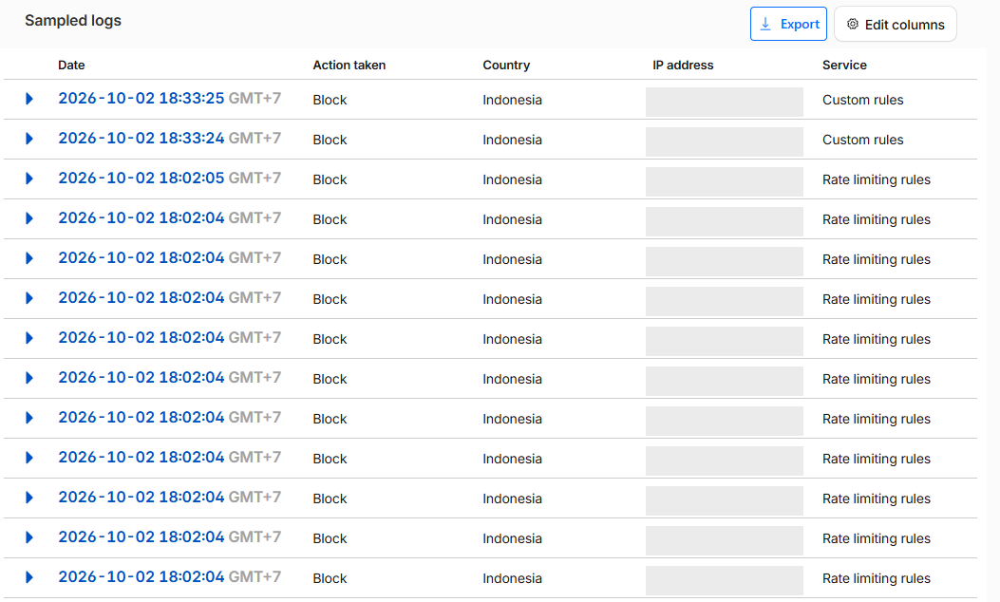

# G6 evidence: Cloudflare in front of the AWS deploy (2026-10-02)

Zone `rizbud.com` on the Cloudflare **Free** plan; the three app hostnames are
proxied CNAMEs to the AWS load balancer ([G4 evidence](G4-aws-deploy.md)).
API hosts are siblings (`ledgerlab-api`, not `api.ledgerlab`) because the free
Universal SSL certificate covers `*.rizbud.com` only.

## Configuration applied

| Setting                          | Value                                                                                                                                                |
| -------------------------------- | ---------------------------------------------------------------------------------------------------------------------------------------------------- |
| DNS                              | `ledgerlab`, `ledgerlab-api`, `ledgerlab-reports` → ALB, **Proxied**; ACM validation CNAMEs **DNS only**                                             |
| SSL/TLS                          | **Full (strict)**: the ALB serves a valid ACM certificate for all three names                                                                        |
| HTTP → HTTPS                     | Redirect rule, Request URL `http://*` → `https://${1}`, query string kept                                                                            |
| Origin lock                      | Request Header Transform rule adds `X-Origin-Secret` on the two API hosts (value from Secrets Manager)                                               |
| Custom rule `Block internal API` | `(http.host eq "ledgerlab-api.rizbud.com" and starts_with(http.request.uri.path, "/api/internal/"))` → Block                                         |
| Custom rule `API methods`        | `(http.host in {"ledgerlab-api.rizbud.com" "ledgerlab-reports.rizbud.com"} and not http.request.method in {"GET" "POST" "PATCH" "OPTIONS"})` → Block |
| Rate limiting rule               | URI path starts with `/api/`, per IP, 50 requests / 10 s → Block 10 s (the free plan only accepts a path expression and a 10 s period)               |
| Cache rules                      | API hosts → **Bypass cache**; `ledgerlab.rizbud.com/assets/*` → eligible, Edge TTL 1 year                                                            |
| Managed rulesets                 | Free Managed Ruleset only; the full Cloudflare Managed and OWASP rulesets need a paid plan                                                           |

## Verification

```
# DNS: Cloudflare anycast addresses, not AWS
ledgerlab.rizbud.com          172.67.190.205 104.21.20.14
ledgerlab-api.rizbud.com      172.67.190.205 104.21.20.14
ledgerlab-reports.rizbud.com  172.67.190.205 104.21.20.14

# Edge certificate
subject=CN = rizbud.com
issuer=C = US, O = Google Trust Services, CN = WE1

# GET https://ledgerlab-api.rizbud.com/health (headers)
HTTP/1.1 200 OK
strict-transport-security: max-age=31536000; includeSubDomains; preload
x-content-type-options: nosniff
x-frame-options: DENY
cf-cache-status: DYNAMIC
Server: cloudflare
CF-RAY: a44334665fb74a32-MRS

# HTTP is redirected at the edge (all three hosts)
http://ledgerlab-api.rizbud.com/health?x=1 -> https://ledgerlab-api.rizbud.com/health?x=1

# /api/internal/* blocked at the edge by the custom rule
$ curl -s -o /dev/null -w '%{http_code}\n' https://ledgerlab-api.rizbud.com/api/internal/account-totals
403

# Methods the dashboard never uses are blocked
DELETE https://ledgerlab-api.rizbud.com/api/accounts            -> 403
PUT    https://ledgerlab-reports.rizbud.com/api/reports/dashboard -> 403

# Rate limit: 100 parallel GETs to /api/accounts
     23 200
     77 429
$ curl -s -D - https://ledgerlab-api.rizbud.com/api/accounts
HTTP/1.1 429 Too Many Requests
Retry-After: 6
Server: cloudflare
error code: 1015

# Cache: hashed asset cached at the edge, API never cached
GET /assets/index-CXj5ZtYC.js   cf-cache-status: MISS, then HIT
GET /api/accounts               cf-cache-status: DYNAMIC

# Origin lock, before the transform rule existed (any request not from our zone)
GET https://ledgerlab-api.rizbud.com/api/accounts
403 {"error":{"code":"FORBIDDEN","message":"Direct origin access is not allowed"}}

# Straight to the ALB, bypassing Cloudflare
curl -sk --max-time 8 https://<alb-dns-name>/health   -> no connection (security group admits Cloudflare ranges only)
```

The block events for the requests above, from **Security → Events** (client
IP redacted): the two custom-rule blocks at 18:33 WIB are the `/api/internal`
and `DELETE` requests, the rate-limiting blocks at 18:02 the burst test.



## Notes

- `HEAD` is not in the allowed method list, so `curl -I` on the API hosts
  returns 403 at the edge; add `"HEAD"` only if an uptime monitor needs it.
- The redirect rule's template first matched only the apex
  (`http://rizbud.com/*`), so plain HTTP on the app hosts reached the ALB on
  port 80 and returned 522. Matching `http://*` fixed it; confirmed from an
  external checker as well. A browser that had already seen the HSTS header
  hid the problem by upgrading to HTTPS itself.
